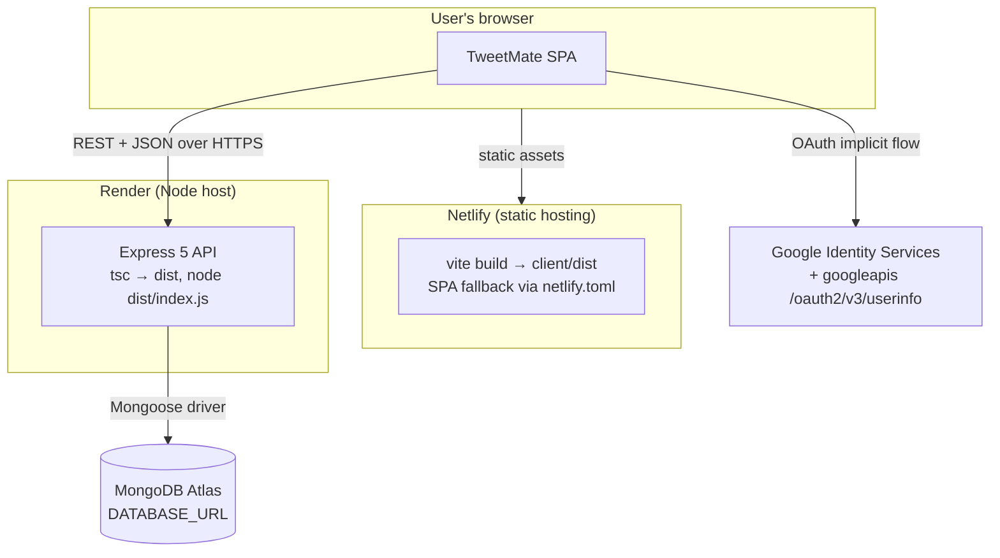
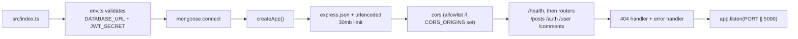
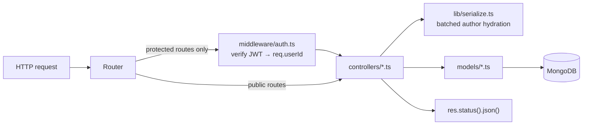

# 1. Architecture

## 1.1 Tech stack

### Client (`client/`)

| Concern | Library |
| --- | --- |
| Language | **TypeScript 7** (`strict`, `noUncheckedIndexedAccess`, `noUnusedLocals`) |
| UI | `react` 19 + `react-dom` 19 (`createRoot`, `StrictMode`) |
| Build | **Vite 8** + `@vitejs/plugin-react` (replaced Create React App) |
| Routing | `react-router-dom` 7 (`createBrowserRouter`) |
| Server state | **`@tanstack/react-query` 5** — caching, dedupe, loading/error, retries |
| Client state | Two React Contexts: `AuthProvider`, `PostFormProvider` |
| HTTP | `axios` (one shared instance + bearer-token interceptor) |
| Auth | `@react-oauth/google` (implicit flow) + `jwt-decode` 4 for expiry |
| Images | `compressorjs` + `FileReader` → base64 data URLs |
| Dialogs | `sweetalert2` (`Confirm` / `Notification` mixins) |
| Sharing | `react-share` (`WhatsappShareButton`) |
| Dates | `date-fns` (`formatDistanceToNow`) |
| Styling | CSS Modules (`*.module.css`), one per component — unchanged |

### Server (`server/`)

| Concern | Library |
| --- | --- |
| Language | **TypeScript 7**, compiled to ESM (`module: NodeNext`) |
| HTTP | **Express 5** (`express.json` / `express.urlencoded` — `body-parser` removed) |
| DB | **Mongoose 9** |
| Auth | `jsonwebtoken` (HS256, 1 hour) + `bcryptjs` 3 (salt rounds 12) |
| Config | `dotenv` 17, centralised in `src/config/env.ts` (fails fast on missing vars) |
| Dev loop | `tsx watch` (replaced `nodemon`) |
| Testing | `mongodb-memory-server` + a hand-rolled smoke suite (`npm test`) |

Both packages are ESM (`"type": "module"`); server relative imports carry explicit `.js` extensions.

## 1.2 Deployment topology



`client/netlify.toml` now declares the build explicitly, because Vite emits to `dist/` rather than
CRA's `build/`:

```toml
[build]
  base = "client"
  command = "npm run build"
  publish = "client/dist"

[[redirects]]
  from = "/*"
  to = "/index.html"
  status = 200
```

The redirect is what makes deep links like `/post/<id>` survive a refresh on a static host.

## 1.3 Repository layout

```
TweetMate/
├── README.md
├── docs/
├── client/                          # React 19 SPA (Vite)
│   ├── index.html                   # Vite entry (moved out of public/)
│   ├── vite.config.ts               # plugin-react, @ alias, vendor chunk split
│   ├── tsconfig.json
│   ├── netlify.toml
│   ├── .env.example                 # VITE_API_URL, VITE_GOOGLE_CLIENT_ID, VITE_SHARE_BASE_URL
│   ├── public/                      # brandLogo.png, manifest.json, robots.txt
│   └── src/
│       ├── main.tsx                 # providers: Google → QueryClient → Auth → PostForm
│       ├── App.tsx                  # router definition only
│       ├── config.ts                # env-driven configuration
│       ├── types/api.ts             # wire-format types (mirrors the server)
│       ├── api/                     # thin typed HTTP layer
│       │   ├── client.ts            #   axios instance, interceptor, toErrorMessage
│       │   ├── auth.ts posts.ts comments.ts users.ts
│       ├── queries/                 # TanStack Query hooks (server state)
│       │   ├── keys.ts posts.ts comments.ts users.ts
│       ├── auth/                    # session (client state)
│       │   ├── AuthContext.tsx      #   provider + useAuth
│       │   └── storage.ts           #   localStorage + JWT expiry helpers
│       ├── postForm/
│       │   └── PostFormContext.tsx  # create/edit draft shared across components
│       ├── pages/                   # route-level components
│       └── components/
│           ├── Navbar/ Auth/ posts/ Profile/ UI/
└── server/                          # Express 5 API
    ├── tsconfig.json
    ├── .env.example
    ├── scripts/dev-memory.ts        # run the API on a throwaway in-memory MongoDB
    ├── test/smoke.ts                # 47-assertion end-to-end suite
    └── src/
        ├── index.ts                 # connect + listen
        ├── app.ts                   # app factory (exported so tests can mount it)
        ├── config/env.ts            # validated environment
        ├── lib/serialize.ts         # batched author lookups + response shaping
        ├── types/                   # api.ts (wire format), express.d.ts (req.userId)
        ├── models/ controllers/ routes/ middleware/
```

## 1.4 Server bootstrap



Splitting `app.ts` (the factory) from `index.ts` (connect + listen) is what lets the smoke suite
mount the real app against an in-memory database.

The layering is unchanged — routes never touch Mongoose, controllers never parse auth headers:



## 1.5 Running locally

### Prerequisites
- Node.js **20.19+** (Vite 8 and Mongoose 9 both require it)
- A MongoDB connection string — or use `npm run dev:memory` and skip it
- A Google OAuth Client ID if you want Google sign-in

### Server

```bash
cd server
npm install
cp .env.example .env      # then fill in DATABASE_URL and JWT_SECRET
npm run dev               # tsx watch → http://localhost:5000
```

| Script | What it does |
| --- | --- |
| `npm run dev` | Watch mode against the `DATABASE_URL` in `.env` |
| `npm run dev:memory` | Same, but spins up a throwaway in-memory MongoDB first |
| `npm test` | End-to-end smoke suite (47 assertions) on its own database |
| `npm run typecheck` | `tsc --noEmit` |
| `npm run build` | `tsc` → `dist/` |
| `npm start` | `node dist/index.js` (production) |

Environment variables:

| Key | Required | Purpose |
| --- | :---: | --- |
| `DATABASE_URL` | yes | Mongo connection string |
| `JWT_SECRET` | yes | HMAC secret for signing/verifying tokens |
| `PORT` | no | Listen port, defaults to `5000` |
| `CORS_ORIGINS` | no | Comma-separated allowlist. Unset = allow any origin |

Missing a required variable throws a named error at startup rather than failing later.

### Client

```bash
cd client
npm install
cp .env.example .env      # optional; defaults point at http://localhost:5000
npm run dev               # Vite → http://localhost:3000
```

| Script | What it does |
| --- | --- |
| `npm run dev` | Vite dev server with HMR |
| `npm run build` | `tsc --noEmit` then `vite build` → `dist/` |
| `npm run preview` | Serve the production build locally |
| `npm run typecheck` | `tsc --noEmit` |

Environment variables (all optional, all inlined at build time):

| Key | Default | Purpose |
| --- | --- | --- |
| `VITE_API_URL` | `http://localhost:5000` | API origin |
| `VITE_GOOGLE_CLIENT_ID` | `''` | Google OAuth client ID. When empty the Google button is hidden |
| `VITE_SHARE_BASE_URL` | `window.location.origin` | Origin used to build shareable post links |

Nothing is hardcoded any more — the previous code had the API origin baked into five separate files.
