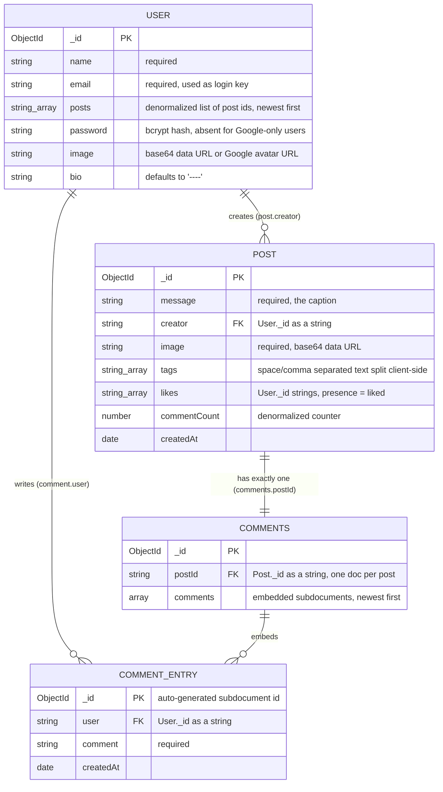
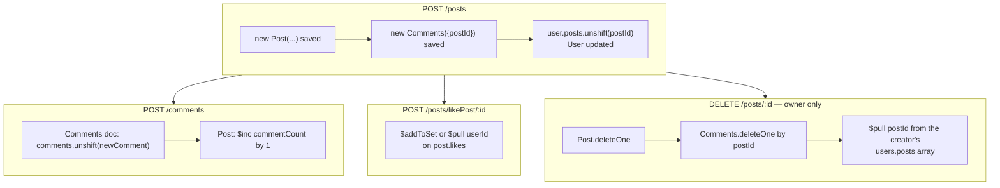
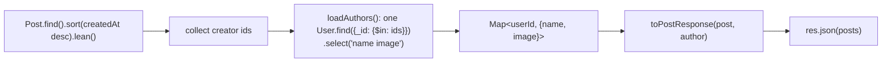

# 2. Data model

Three Mongoose models live in `server/src/models/`, each with an explicit TypeScript interface.
There are **no `ObjectId` refs and no `populate()`** anywhere — every relationship is stored as a
*stringified* ObjectId and resolved with a batched follow-up query inside the controller.

## 2.1 Entity relationship



## 2.2 Collections in detail

### `users` — `server/src/models/user.ts`

| Field | Type | Required | Default | Notes |
| --- | --- | --- | --- | --- |
| `name` | String | yes | — | For email signup this is `"<firstName> <lastName>"`; for Google it's the Google profile name |
| `email` | String | yes | — | Effective unique key, but **no unique index** — uniqueness is enforced only by a `findOne` check in `signUp` |
| `posts` | [String] | yes | `[]` | Denormalized. New post ids are **unshifted**, so it is newest-first |
| `password` | String | no | — | bcrypt hash (salt rounds 12). Absent when the account was created via Google |
| `image` | String | no | — | Either a Google avatar URL or a compressed base64 data URL uploaded by the user |
| `bio` | String | yes | `'----'` | Free text, rendered line-by-line in the profile |

A `password`-less user is the signal for "this is a Google account" — `signIn` returns
*"Please log in via google!!"* if such a user tries a password login.

### `posts` — `server/src/models/posts.ts`

| Field | Type | Required | Default | Notes |
| --- | --- | --- | --- | --- |
| `message` | String | yes | — | Caption. Rendered by splitting on `\n` into `<p>` blocks |
| `creator` | String | yes | — | `User._id`. Set server-side from `req.userId`, never trusted from the body |
| `image` | String | yes | — | Base64 data URL. This is why the body limit is 30 MB |
| `tags` | [String] | no | `[]` | Normalized server-side from the comma/space separated string the form sends |
| `likes` | [String] | yes | `[]` | Toggle semantics, written with `$addToSet` / `$pull` |
| `commentCount` | Number | yes | `0` | Kept in sync via `$inc` on comment creation |
| `createdAt` | Date | yes | `Date.now` | Function reference, so each document gets its own timestamp |

### `comments` — `server/src/models/comments.ts`

One document per post, holding an **embedded array** of comment subdocuments.

| Field | Type | Required | Default | Notes |
| --- | --- | --- | --- | --- |
| `postId` | String | yes | — | `Post._id`. The doc is created at the same time as the post |
| `comments` | [ { user, comment, createdAt } ] | yes | `[]` | New comments are **unshifted** → newest-first |

Each embedded entry gets its own auto-generated `_id`, which the client uses as the React list key.

## 2.3 Lifecycle of a post

Because the model is denormalized in three places (`posts` collection, `users.posts` array,
`comments` doc), every write touches more than one collection:



None of this runs in a transaction, so a crash midway leaves the denormalized copies out of sync.

## 2.4 Read-time hydration (the "poor man's join")

The client needs an author name and avatar next to every post, but `posts` only stores a `creator`
id. `server/src/lib/serialize.ts` resolves them **in a single batched query** and merges the result:



The old implementation issued one `User.findOne` per document, so the feed cost O(number of posts)
round trips. The same batched helper backs `getPost`, `createPost`, `editPost`, `likePost`, and —
per comment — `getComments` / `addComments`, where each entry gains `{ name, image }`.

A missing author no longer throws; the response falls back to `userName: "Unknown user"`.

This means the wire format is **wider than the schema**. A post as seen by the client
(`PostResponse` in `server/src/types/api.ts`, mirrored by `Post` in `client/src/types/api.ts`) is:

```jsonc
{
  "_id": "…",
  "message": "…",
  "creator": "<userId>",
  "image": "data:image/jpeg;base64,…",
  "tags": ["fun", "code"],
  "likes": ["<userId>", "…"],
  "commentCount": 3,
  "createdAt": "2023-05-01T10:00:00.000Z",

  "userName": "Ada Lovelace",   // ← joined in by the controller
  "userImage": "…"              // ← joined in by the controller
}
```

Comments are no longer stitched onto the post object; they live in their own React Query cache entry
under `['comments', postId]`.

### `tags`: string on the wire, array in the database

`PostForm` still binds a single `<input name="tags">` to a string, but the server now normalizes it
with `normalizeTags()` — splitting on commas and whitespace, stripping a leading `#`, and dropping
empties. So `"react, vite  typescript"` is stored as `["react", "vite", "typescript"]` and renders as
three separate tags. Previously it was stored as the single element `["react, vite  typescript"]` and
rendered as one malformed tag.
