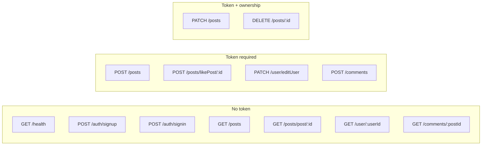
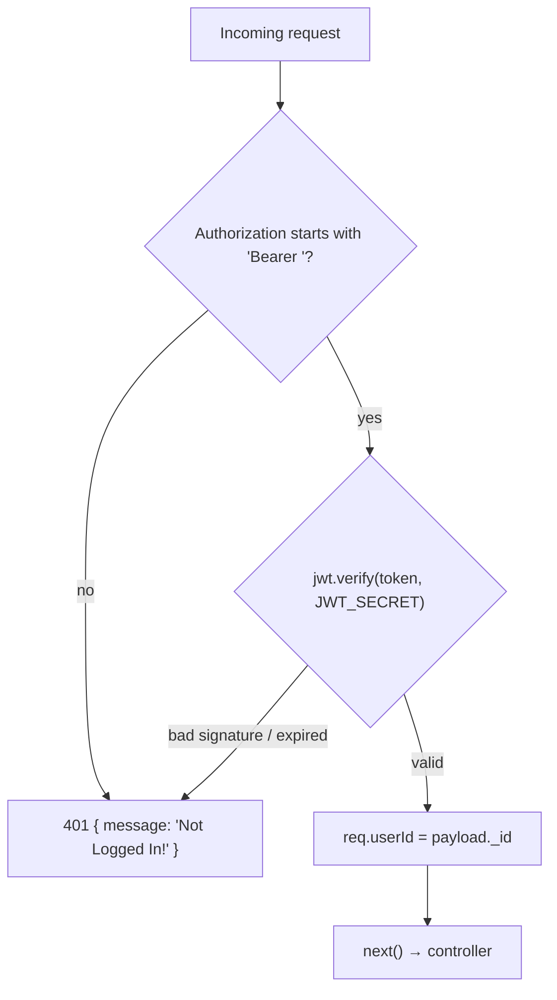

# 3. API reference

**Base URL:** `VITE_API_URL` on the client; `http://localhost:5000` by default.

JSON in, JSON out. Authentication is a bearer JWT:

```
Authorization: Bearer <token>
```

## 3.1 Endpoint map

| Method | Path | Auth | Handler | Purpose |
| --- | --- | :---: | --- | --- |
| `GET` | `/health` | — | inline | Liveness + Mongo connection state |
| `POST` | `/auth/signup` | — | `signUp` | Register (email/password **or** Google) |
| `POST` | `/auth/signin` | — | `signIn` | Log in (email/password **or** Google) |
| `POST` | `/auth/forgot` | — | `forgotPassword` | Email a reset link |
| `POST` | `/auth/reset` | — | `resetPassword` | Set a new password from a token |
| `GET` | `/posts` | — | `getPosts` | Feed, newest first, author-hydrated |
| `GET` | `/posts/post/:id` | — | `getPost` | One post, author-hydrated |
| `POST` | `/posts` | ✅ | `createPost` | Create a post |
| `PATCH` | `/posts` | ✅ 🔑 | `editPost` | Edit own post (id in the **body**) |
| `POST` | `/posts/likePost/:id` | ✅ | `likePost` | Toggle like |
| `DELETE` | `/posts/:id` | ✅ 🔑 | `deletePost` | Delete own post + its comment thread |
| `GET` | `/user/:userId` | — | `showProfile` | Public profile (no password hash) |
| `PATCH` | `/user/editUser` | ✅ | `editUser` | Update own `bio` and `image` |
| `GET` | `/comments/:postId` | — | `getComments` | Comment thread, commenter-hydrated |
| `POST` | `/comments` | ✅ | `addComments` | Append a comment |
| `DELETE` | `/comments/:postId/:commentId` | ✅ 🔑 | `deleteComment` | Remove a comment |
| `GET` | `/uploads/config` | — | `uploadConfig` | Is object storage on, and the size cap |
| `POST` | `/uploads/sign` | ✅ | `signUpload` | Presigned R2 `PutObject` URL |

✅ = requires a valid token &nbsp;•&nbsp; 🔑 = additionally requires **ownership**



## 3.2 The auth middleware



- Payload is `{ email, _id }`, HS256, **expires in 1 hour**.
- Every failure returns **401** (previously `400`, which conflated auth failure with bad input).
- Controllers read `req.userId` and never trust a creator id from the request body.

## 3.3 Auth endpoints

### `POST /auth/signup`

Two shapes, discriminated by the `google` flag.

<details>
<summary>Email/password body</summary>

```jsonc
{
  "firstName": "Ada",
  "lastName": "Lovelace",
  "email": "ada@example.com",
  "password": "secret",
  "confirmPassword": "secret"
}
```
</details>

<details>
<summary>Google body</summary>

```jsonc
{ "google": true, "name": "Ada Lovelace", "email": "ada@example.com", "image": "https://…" }
```
</details>

1. Existing email → `400 User already exists!!`
2. Google branch → created with no password.
3. Email branch → mismatched passwords `400`; otherwise bcrypt (salt rounds 12), name is
   `"<firstName> <lastName>"`.

**200** (identical for signup and signin):

```jsonc
{ "user": { "_id": "…", "image": "…", "bio": "----" }, "token": "eyJhbGciOi…" }
```

### `POST /auth/signin`

| Body | Behaviour |
| --- | --- |
| `{ email, password }` | `404 User not found!!`; `400 Please log in via google!!` if the account has no password; `400 Incorrect Password!!` on mismatch |
| `{ email, google: true, image }` | Skips password checks; backfills a missing avatar from Google |

## 3.4 Post endpoints

### `GET /posts`
Array of every post **sorted newest first**, each merged with `userName` / `userImage`.
Authors are resolved with a **single batched query**, not one lookup per post.
Still unpaginated — see [Gotchas](./06-gotchas.md).

### `GET /posts/post/:id`
One hydrated post, or `404 Post not found!!`.

### `POST /posts` 🔒
Body `{ message, image, tags }`. `tags` may be an array **or** a comma/space separated string; the
server normalizes it (`"react, vite  ts"` → `["react","vite","ts"]`). The server sets
`creator: req.userId` and `createdAt`, saves the post, creates its `Comments` document, and unshifts
the id onto `user.posts`.

**201** → the post merged with `userName` / `userImage`.

### `PATCH /posts` 🔒🔑
Body `{ _id, message, image, tags }`. Rejects with `403` unless `post.creator === req.userId`.

Only `message`, `image` and `tags` are written — `creator`, `likes`, `commentCount` and `createdAt`
can no longer be overwritten from the request body.

### `POST /posts/likePost/:id` 🔒
Toggle, implemented atomically with `$addToSet` / `$pull`. Returns the updated, hydrated post.

### `DELETE /posts/:id` 🔒🔑
`403` unless the caller is the creator. Deletes the post, its `Comments` document, and prunes the id
from the **creator's** `posts` array.

## 3.5 User endpoints

### `GET /user/:userId`
Public profile, projected with `-password`:

```jsonc
{ "_id": "…", "name": "Ada Lovelace", "email": "…", "posts": ["…"], "image": "…", "bio": "…" }
```

### `PATCH /user/editUser` 🔒
Body `{ bio, image }`. The target is **always `req.userId`** — any `_id` in the body is ignored, so
one user can no longer write over another's document.

**200** → `{ _id, bio, image }`.

## 3.6 Comment endpoints

### `GET /comments/:postId`
Thread with every entry enriched with the commenter's `name` / `image`, resolved in one batched
query. A post with no thread document returns an empty thread rather than an error.

```jsonc
{
  "_id": "…",
  "postId": "…",
  "comments": [
    { "_id": "…", "user": "…", "comment": "nice!", "createdAt": "…", "name": "Ada Lovelace", "image": "…" }
  ]
}
```

### `POST /comments` 🔒
Body `{ postId, comment: { comment } }`. **The author is taken from the token**, not the body — the
endpoint used to be unauthenticated and trusted `comment.user`, so anyone could post as anyone.
Empty comments are rejected with `400`. Increments `Post.commentCount`.

### `DELETE /comments/:postId/:commentId` 🔒🔑
Two people may delete a comment: **whoever wrote it, and whoever owns the post**. The second case is
the point — without it there is no way to take an abusive comment off your own photo. Returns the
updated thread. `commentCount` is decremented under a `{ $gt: 0 }` guard so it can never go negative.

## 3.7 Password reset

Both routes are rate limited, and both are inert unless `BREVO_API_KEY` and `MAIL_FROM` are set —
`/auth/forgot` answers **`503`** when mail is unconfigured.

### `POST /auth/forgot`
Body `{ email }`. Returns `{ message, creating }`, or **`404`** when there is no such account.

**This deliberately confirms whether an address is registered.** An earlier version answered `200`
for everything to avoid being an enumeration oracle, but that protected nothing: `signIn` already
replies `404 "User not found!!"` for an unknown address and `400 "Please log in via google!!"` for a
known one. The vagueness only left people watching an inbox that would never receive anything. The
real defence here is the rate limit — 5 per hour — not the wording. If you ever want to close
enumeration, it has to be done across `signup`, `signin` and `forgot` together; doing one is
worthless.

`creating` is `true` for an account that signed up through Google and therefore has **no password
yet**. Such an account still gets a link — that is how it gains one — and the email says *set* rather
than *reset*. Completing it leaves both sign-in methods working.

Generates a 32-byte token, stores only its **SHA-256 hash** plus a 30-minute expiry, and emails the
raw token as a link. If the email fails to send, the stored token is cleared rather than left
stranded.

### `POST /auth/reset`
Body `{ token, email, password, confirmPassword }`. Compares hashes in constant time, checks the
expiry, then writes a new bcrypt hash and **clears the token so the link cannot be replayed**.
Returns a session, so the user is signed in rather than bounced back to a login form.

## 3.8 Rate limiting

A small in-process fixed-window limiter (`middleware/rateLimit.ts`). Keyed by user id when the
request is authenticated, otherwise by client IP from `X-Forwarded-For`.

| Route | Limit |
| --- | --- |
| `POST /auth/signin` | 20 / 15 min |
| `POST /auth/signup` | 30 / hour |
| `POST /auth/forgot` | 5 / hour |
| `POST /auth/reset` | 10 / hour |
| `POST /uploads/sign` | 40 / hour **per account** |
| `POST`/`PATCH /posts` | 60 / hour |
| `POST /comments` | 120 / hour |

`/uploads/sign` is the one that matters most: every signature is a licence to write an object to the
Cloudinary bucket, so without a cap one account could exhaust the storage allowance.

Counters live in memory, so they **reset on deploy** and would multiply across instances. That is an
acceptable trade for a single free-tier instance; a shared store would be needed before scaling out.
Exceeding a limit returns **`429`** with a `Retry-After` header.

## 3.9 Upload endpoints

### `GET /uploads/config`
No auth. Returns `{ enabled: boolean, maxBytes: number }`. `enabled` is false when the Cloudinary
environment variables are unset — the client uses it to decide between a direct upload and the
base64 fallback. `maxBytes` is 8 MB.

### `POST /uploads/sign` 🔒
Body `{ contentType, size }`. Returns:

```json
{
  "uploadUrl": "https://api.cloudinary.com/v1_1/<cloud>/image/upload",
  "apiKey": "8929...",
  "timestamp": 1786826353,
  "signature": "<sha1 of the signed params + api secret>",
  "folder": "tweetmate/posts",
  "maxBytes": 8388608
}
```

The browser POSTs the file to `uploadUrl` as multipart form data with those fields attached, so the
bytes never pass through the API. The signature covers only `folder` and `timestamp`, so it cannot be
replayed to write elsewhere, and Cloudinary rejects it after an hour. Rejects unsupported MIME types
with `400`, anything over `maxBytes` with `413`, and returns **`503`** when storage is not configured.

**The API secret never leaves the server.** Only the signature does.

## 3.10 Error conventions

Bodies are always `{ "message": "<text>" }`.

| Status | Meaning |
| --- | --- |
| `400` | Validation failure (bad credentials, empty comment, mismatched passwords, bad upload type) |
| `401` | Missing, malformed or expired token |
| `403` | Authenticated, but not the owner of the resource |
| `404` | User, post, comment or route not found — including "no account for that address" |
| `409` | Post creation failed |
| `413` | Upload larger than the 8 MB cap |
| `500` | Unexpected failure |
| `503` | Object storage requested but not configured |

There is now a catch-all `404` handler for unknown routes and a top-level error handler, so the API
never returns Express's HTML error page.

## 3.11 Verification

`server/test/smoke.ts` mounts the real app against an in-memory MongoDB and asserts **47** behaviours
across every endpoint — auth, ownership (403s), the token-over-body comment author, password-hash
projection, cascade delete, tag normalization and feed ordering.

```bash
cd server && npm test
```
