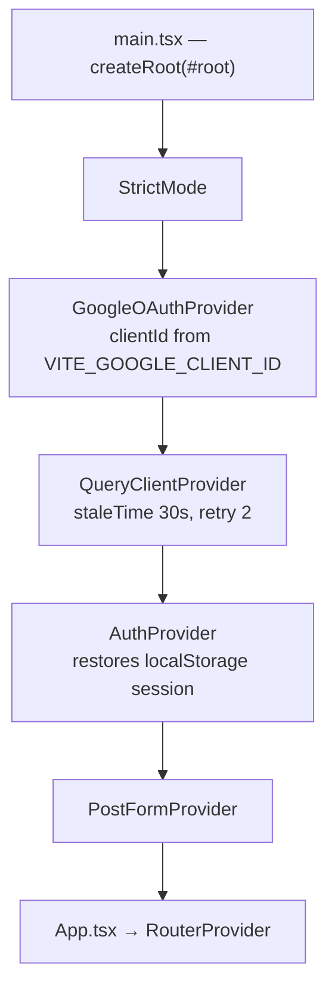
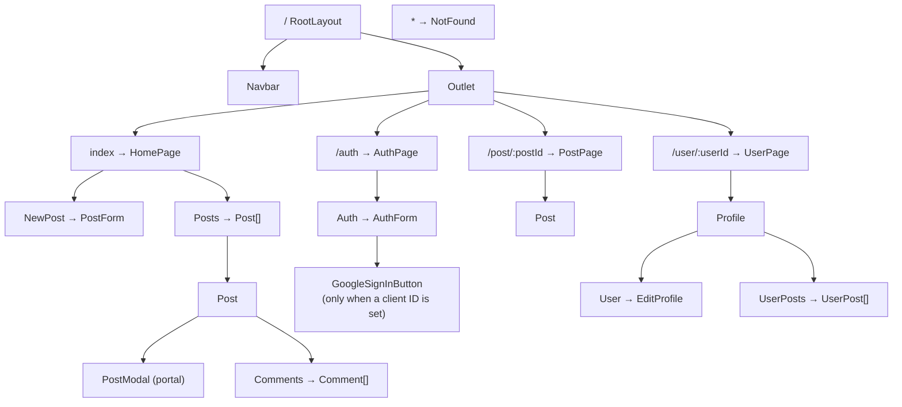
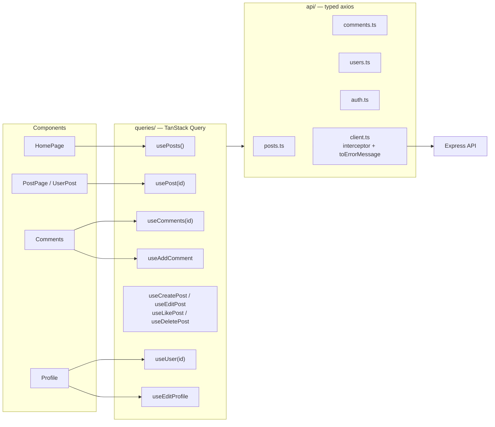
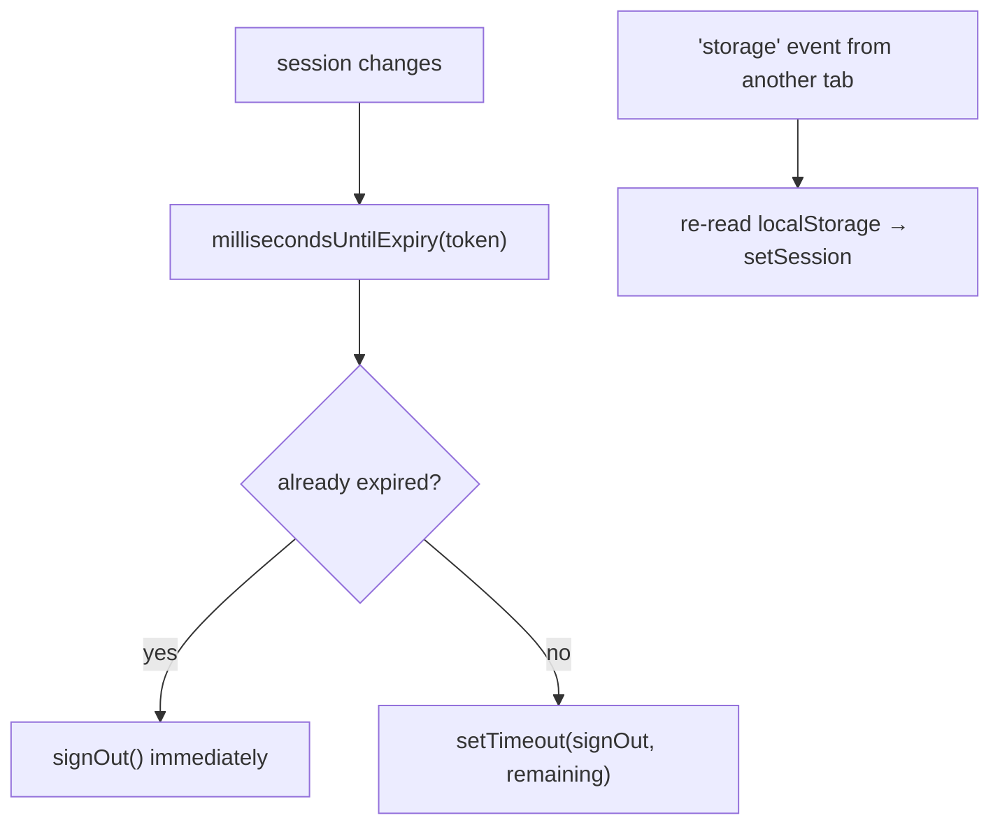

# 4. Frontend & state

The Redux store is gone. State is now split by **who owns it**:

| Kind of state | Owner | Why |
| --- | --- | --- |
| Posts, comments, profiles | **TanStack Query** | It is a cache of server data — caching, dedupe, loading/error and retries come for free |
| Session (JWT + user) | **`AuthProvider`** Context | Genuine client state, tiny, changes rarely |
| Create/edit post draft | **`PostFormProvider`** Context | Shared between `PostModal` and `PostForm`, never persisted |

## 4.1 Bootstrap chain



Two things happen before the first paint:

1. `AuthProvider` calls `readStoredSession()`, which **discards an already-expired token** instead of
   handing back a dead session.
2. No data is fetched. Each route asks for exactly what it needs — unlike the old `App.js`, which
   eagerly loaded the entire feed on every boot.

`index.html` provides `#root`, `#overlay-root` and `#modal-root`; the last two back all portals.

## 4.2 Routes

| Path | Element | Notes |
| --- | --- | --- |
| `/` | `RootLayout` | Navbar + `<Outlet/>`; `errorElement` is `ErrorPage` |
| `/` (index) | `HomePage` | `NewPost` + `Posts`, with real loading and error states |
| `/auth` | `AuthPage` | Redirects to `/` when already authenticated |
| `/post/:postId` | `PostPage` | **Fetches independently** — deep links no longer need the feed |
| `/user/:userId` | `UserPage` | Profile header + post grid |
| `*` | `NotFound` | Outside `RootLayout`, so no navbar |



## 4.3 The data layer



Every hook returns `{ data, isPending, isError, error }`, so loading and failure are handled at the
component that needs them — the old code funnelled every failure into `console.log`.

### Cache keys

```ts
queryKeys = {
  posts:              ['posts'],
  post:    (id)   =>  ['posts', id],
  comments:(postId)=> ['comments', postId],
  user:    (userId)=> ['users', userId],
}
```

### How mutations keep the cache correct

| Mutation | Cache effect |
| --- | --- |
| `useCreatePost` | Prepends to `['posts']`, seeds `['posts', id]`, invalidates the author's profile |
| `useEditPost` | Replaces the post in `['posts']` and `['posts', id]` |
| `useLikePost` | Same — the server returns the whole updated post |
| `useDeletePost` | Filters `['posts']`, removes `['posts', id]` and `['comments', id]`, invalidates profiles |
| `useAddComment` | Writes the thread to `['comments', postId]` and syncs `commentCount` on the post |
| `useEditProfile` | Updates the session, invalidates the profile **and the feed** (avatars are denormalized into every post) |

That last row is a bug fix: previously, changing your avatar left every cached post showing the old one.

### `usePost` and deep links

```ts
useQuery({
  queryKey: queryKeys.post(postId),
  queryFn: () => fetchPost(postId),
  // Show the feed's copy instantly, but still fetch.
  placeholderData: () =>
    queryClient.getQueryData<Post[]>(queryKeys.posts)?.find((p) => p._id === postId),
});
```

Navigating from the feed renders immediately; opening `/post/:id` cold issues exactly one request
(`GET /posts/post/:id`) and never loads the feed.

The same hook backs each profile-grid tile, so React Query **dedupes and caches** those requests —
revisiting a profile costs nothing.

## 4.4 Auth context

```ts
const { session, user, isAuthenticated, signIn, signUp, signOut, updateUser } = useAuth();
```

`AuthProvider` also does two things the old reducer did not:



- **Proactive expiry.** The user is signed out the instant the token dies, not on the next request.
- **Cross-tab sync.** Signing out in one tab signs out the others.

`localStorage.user` remains the single source of truth for the token — the axios interceptor reads
it directly, so a request can never carry a token the provider has already discarded.

## 4.5 Post-form context

The create form and the edit form are still the same component, but the mode is now explicit:

```ts
interface PostFormState {
  mode: 'create' | 'edit';
  postId: string | null;
  data: { message: string; tags: string; image: string };
}
```

`PostModal` calls `startEditing(post)` and then scrolls to `#newPost`; `PostForm` reads `mode` to
decide between `useCreatePost` and `useEditPost`, and calls `reset()` afterwards.

## 4.6 Components of note

| Component | Role |
| --- | --- |
| `Navbar` | Brand, scroll-to-composer button, home link, avatar → portal menu (Profile / Logout) |
| `AuthForm` | Sign-in/sign-up toggle, validation, error toasts |
| `GoogleSignInButton` | Isolated so `useGoogleLogin` only mounts when a client ID exists — otherwise Google's script throws and takes down the page |
| `Post` | Card: author, relative time, tags, image, caption, like/comment/share, `…` menu |
| `PostModal` | Portal menu: View, Edit (owner), Copy Link, Delete (owner) |
| `Comments` | Lazy thread — `useComments` only runs once opened |
| `UI/Form/Image` | compressorjs (quality 0.6) → base64; uses `useId` so two uploaders can coexist |
| `UI/Popups` | `notifySuccess` / `notifyError` / `notifyWarning` / `confirmAction` wrappers |
| `UI/HashLink/useScrollToHash` | Replaces the unmaintained, untyped `react-router-hash-link` |

## 4.7 Notifications

Toasts are fired from **event handlers and mutation callbacks**, never during render. The old code
called `Notification.fire()` in the body of `HomePage` and `Auth` and passed messages between pages
through router state; that is gone.

## 4.8 Build output

`vite.config.ts` splits vendors so app code can be cached independently:

| Chunk | Gzipped |
| --- | --- |
| `react-vendor` | ~60 kB |
| `router` | ~30 kB |
| `sweetalert` | ~21 kB |
| `query` | ~10 kB |
| app code | ~42 kB |

A production build takes about a second, versus roughly 40 seconds under CRA.
