# 5. Key flows

Sequence diagrams for every meaningful user journey. Participants:

| Alias | Meaning |
| --- | --- |
| **U** | User / browser |
| **C** | React component |
| **H** | Hook — a React Query hook or a Context method |
| **QC** | TanStack Query cache |
| **AX** | axios layer (`src/api/`) |
| **LS** | `localStorage` |
| **API** | Express server |
| **DB** | MongoDB |

---

## 5.1 App bootstrap

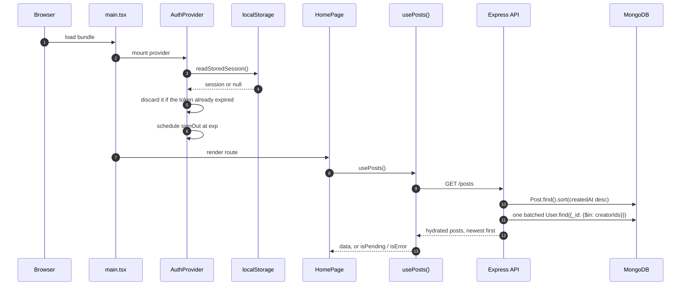

Nothing is fetched at the app root any more — each route requests only what it renders. `HomePage`
distinguishes **loading**, **error with a retry button**, and **genuinely empty**.

---

## 5.2 Email sign-up

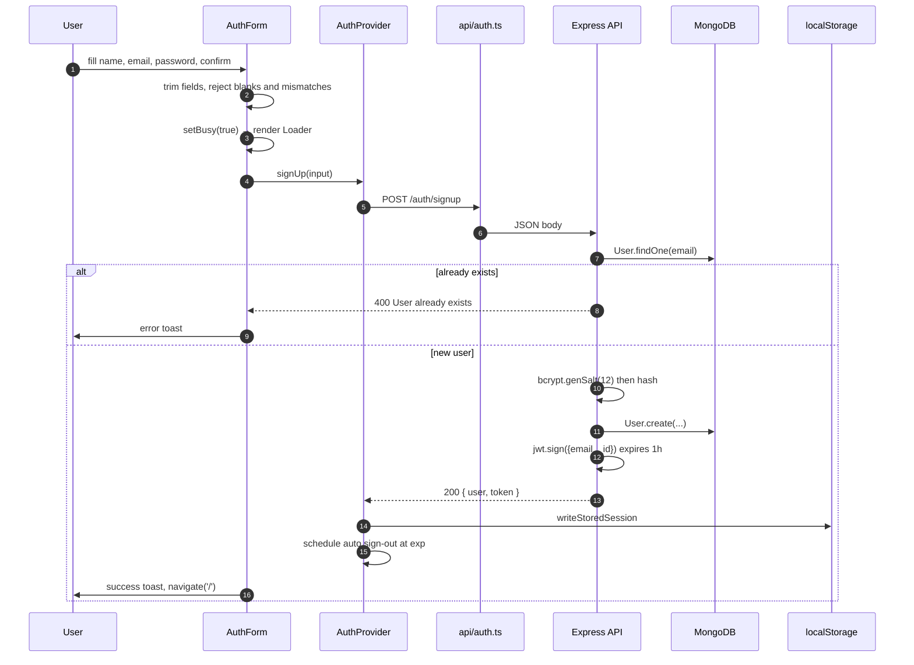

Errors surface as toasts from the `catch` block. The old flow navigated to `/auth` carrying the
message in router state and fired the toast during render.

---

## 5.3 Google sign-in / sign-up

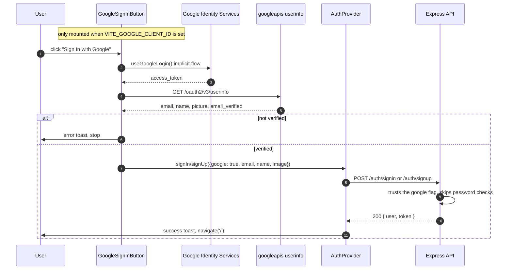

Isolating this in its own component matters: Google's script throws
`Missing required parameter client_id` **on mount** when the ID is empty, which previously took down
the entire auth page.

---

## 5.4 Create a post

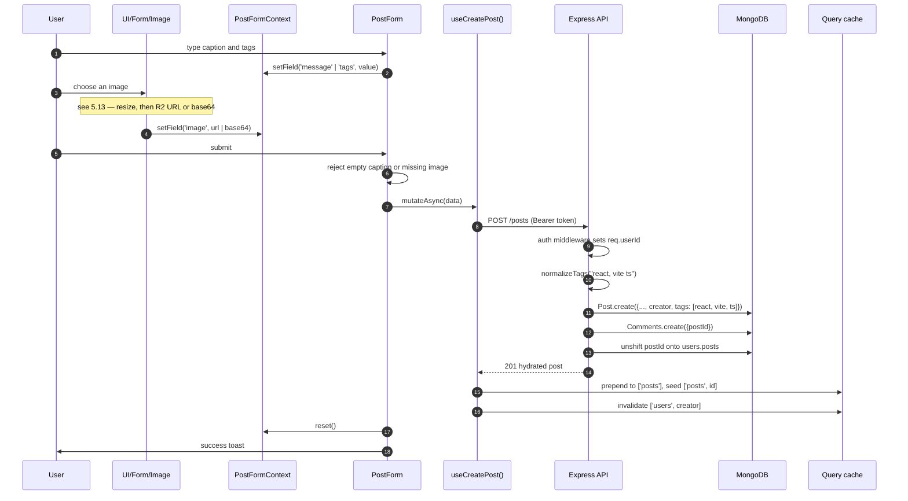

The form only clears **after** the request resolves; a failure keeps the draft and shows the error.

---

## 5.5 Edit a post

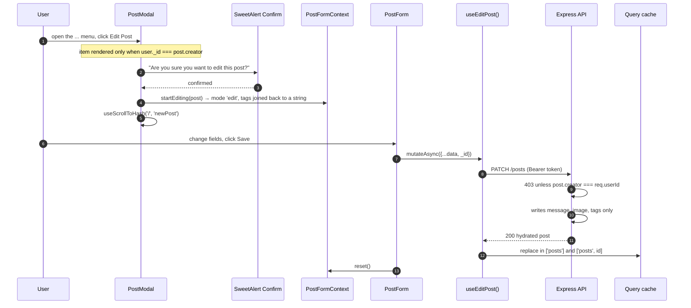

Because the server whitelists fields, `likes`, `commentCount` and `createdAt` survive an edit even
though the form still round-trips the whole post.

---

## 5.6 Delete a post

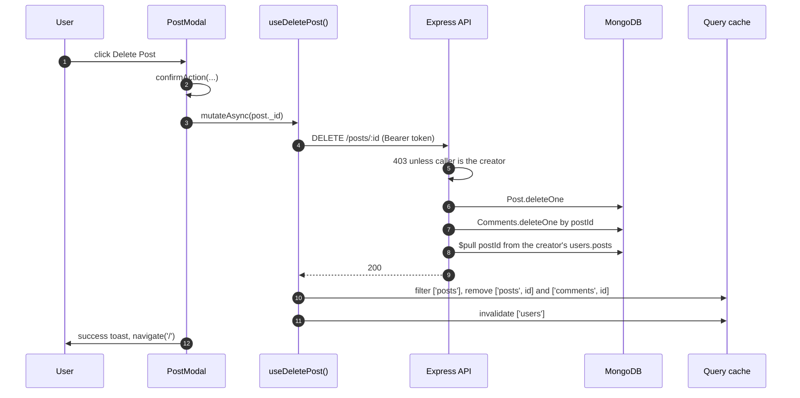

---

## 5.7 Like / unlike

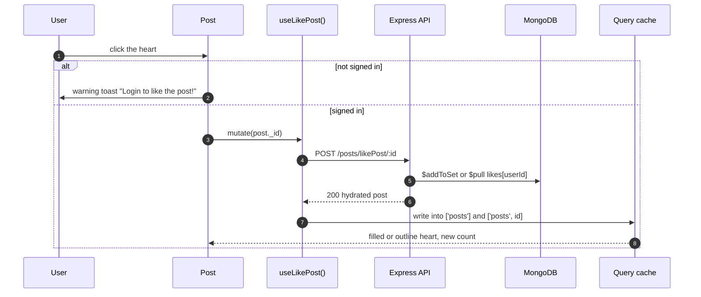

The icon is derived (`post.likes.includes(user._id)`), and the toggle is now a single atomic update
rather than read-modify-write.

---

## 5.8 Comments

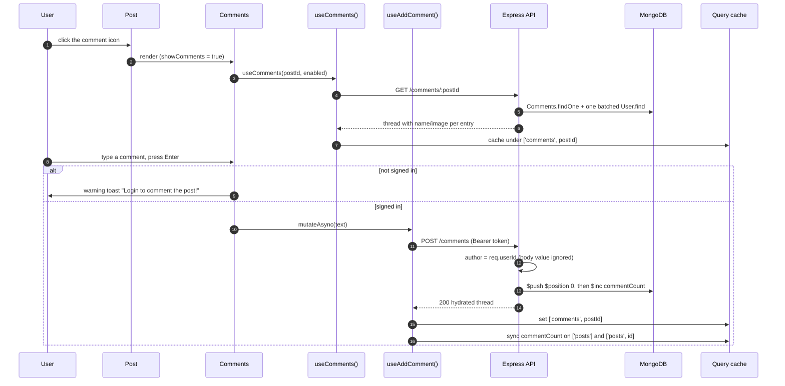

The thread is fetched lazily — `enabled` keeps the query idle until the section is opened.

---

## 5.9 Viewing a profile

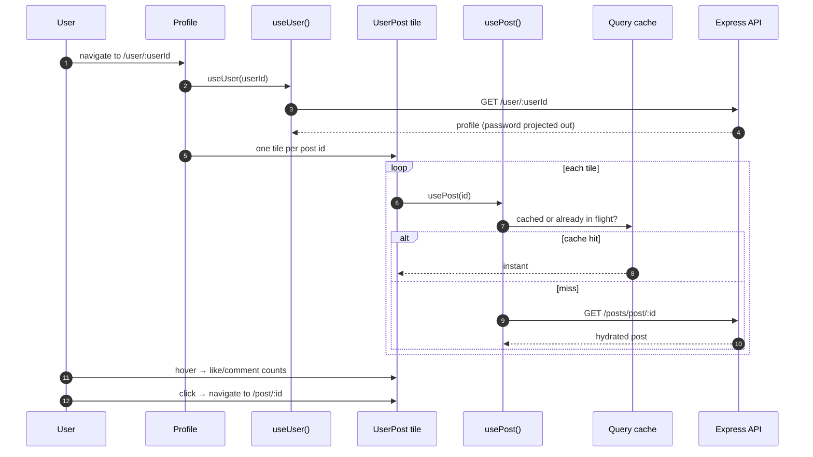

Tiles now share one cache with the feed and every other view, so repeat visits are free — the old
version refetched all N posts on every mount.

---

## 5.10 Editing your profile

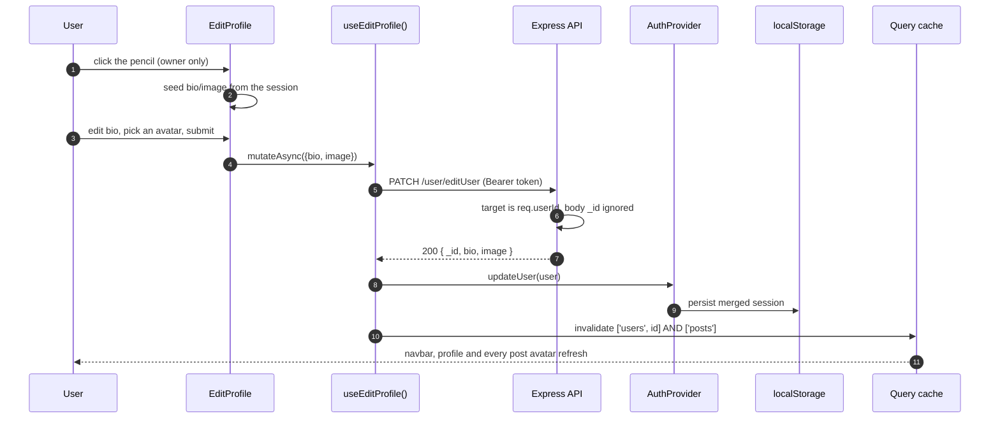

Invalidating `['posts']` is the fix for stale avatars: the author image is denormalized into every
post, so the feed has to be refetched after a profile change.

---

## 5.11 Session expiry and sign-out

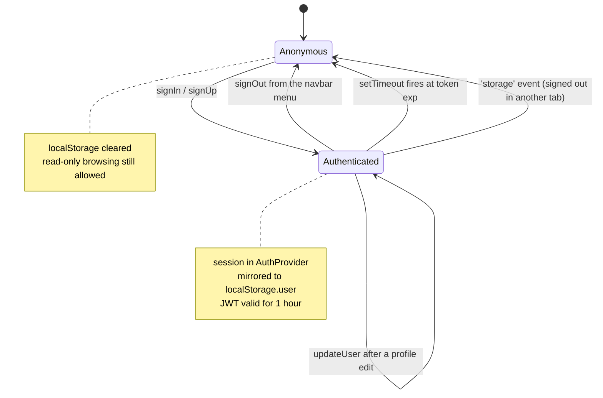

Expiry is **proactive**: `AuthProvider` schedules `signOut` for the exact expiry instant, so an idle
tab logs itself out instead of appearing signed in until the next failed request.

---

## 5.12 Sharing a post

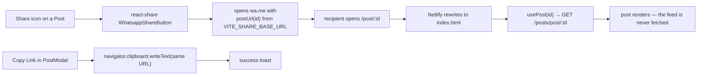

The share origin comes from `VITE_SHARE_BASE_URL` (defaulting to the current origin) instead of a
hardcoded Netlify URL, so links are correct in every environment.

---

## 5.13 Uploading an image

`UI/Form/Image` has two modes. It asks the server which one is live, then takes that branch. The
resize step runs either way — it is what actually shrank the payload.

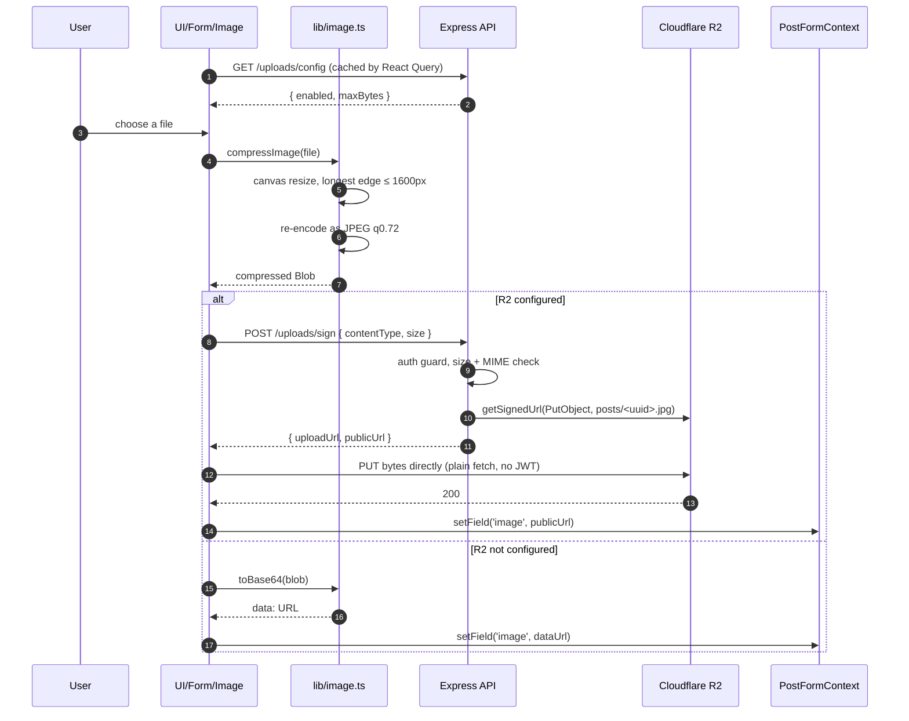

Why it is shaped this way:

| Decision | Reason |
| --- | --- |
| Browser PUTs straight to R2 | Image bytes never touch the free-tier Render instance |
| Presigned URL, not a proxy route | No streaming, no memory spike, no request-size limit to raise |
| Plain `fetch`, not the axios instance | The axios interceptor attaches the JWT — it must not reach R2 |
| `isR2Configured()` gate | Unset credentials fall back to base64, so the code ships before the bucket exists |
| Resize before either branch | 1600px is the cap that turned 2.3 MB images into ~50 KB |
| `cache-control: immutable` on the object | Keys are content-addressed by uuid, so they can be cached forever |

Existing base64 posts are migrated with `npm run migrate:images` in `server/` — a dry run by default,
`-- --apply` to write. It is idempotent: `isRemoteImage()` skips anything already on R2.
