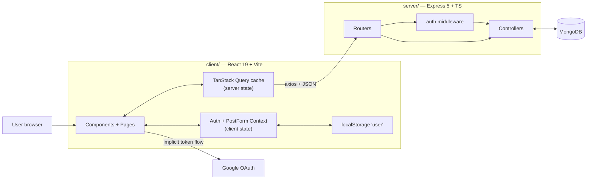

# TweetMate — Documentation

TweetMate is a small Twitter/Instagram-style social app: users sign up (email+password or Google),
publish image posts with a caption and tags, like them, comment on them, share them, and browse
each other's profiles.

Two independently deployed halves, both written in **TypeScript**:

| Half | Folder | Runtime | Deployed on |
| --- | --- | --- | --- |
| Client | `client/` | React 19 SPA built with Vite 8 | Netlify |
| Server | `server/` | Node + Express 5 REST API (ESM) | Render |
| Data | — | MongoDB (Mongoose 9) | MongoDB Atlas |

## Read in this order

| # | Doc | What it answers |
| --- | --- | --- |
| 1 | [Architecture](./01-architecture.md) | What are the moving parts, how do they talk, how do I run it |
| 2 | [Data model](./02-data-model.md) | What is stored in Mongo and how documents reference each other |
| 3 | [API reference](./03-api-reference.md) | Every REST endpoint, its auth requirement, and its payload |
| 4 | [Frontend & state](./04-frontend-and-state.md) | Component tree, routes, React Query cache, Context providers |
| 5 | [Key flows](./05-key-flows.md) | Sequence diagrams for sign-in, posting, liking, commenting, profiles |
| 6 | [Gotchas](./06-gotchas.md) | Remaining sharp edges, and what the migration already fixed |

## The 30-second version



1. The SPA boots and restores the JWT it kept in `localStorage` (discarding it if already expired).
2. **Server data** — posts, comments, profiles — is owned by **TanStack Query**, which handles
   caching, deduplication, loading and error states, and retries.
3. **Client state** — the session and the post-form draft — lives in two small **React Contexts**.
4. Requests carry `Authorization: Bearer <jwt>` via an axios interceptor. Express verifies the token,
   sets `req.userId`, and the controller reads/writes Mongo.
5. Controllers respond with hydrated documents (post + author name/image); mutations write straight
   into the Query cache or invalidate it.

## Commands

```bash
# API — needs DATABASE_URL and JWT_SECRET in server/.env
cd server && npm install && npm run dev

# API without a local MongoDB (throwaway in-memory database)
cd server && npm run dev:memory

# API end-to-end smoke test (47 assertions, spins up its own database)
cd server && npm test

# Client — http://localhost:3000
cd client && npm install && npm run dev
```
